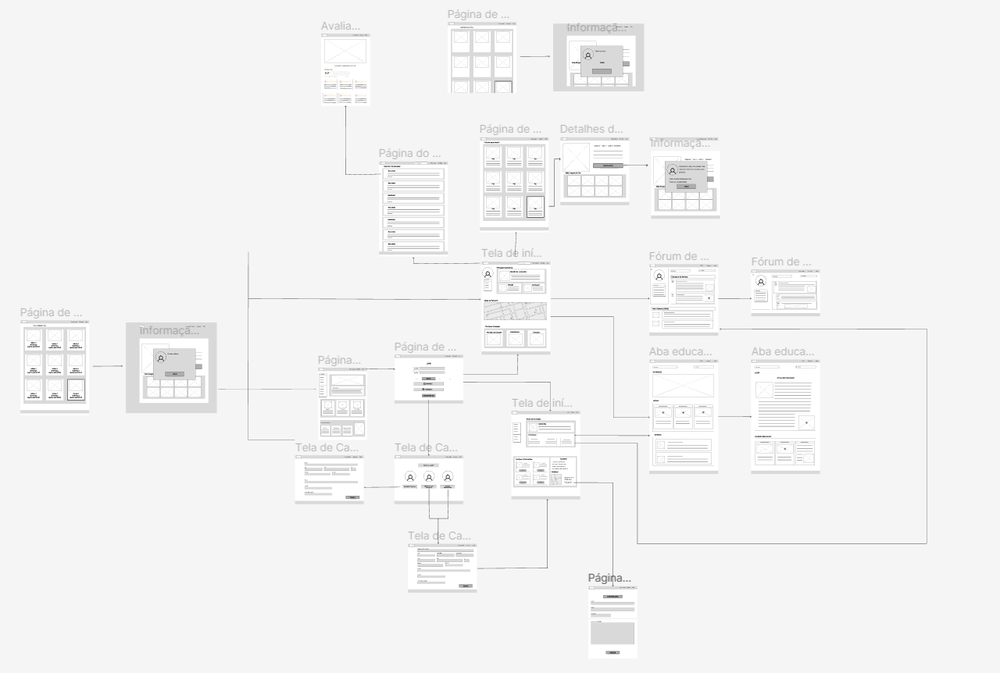
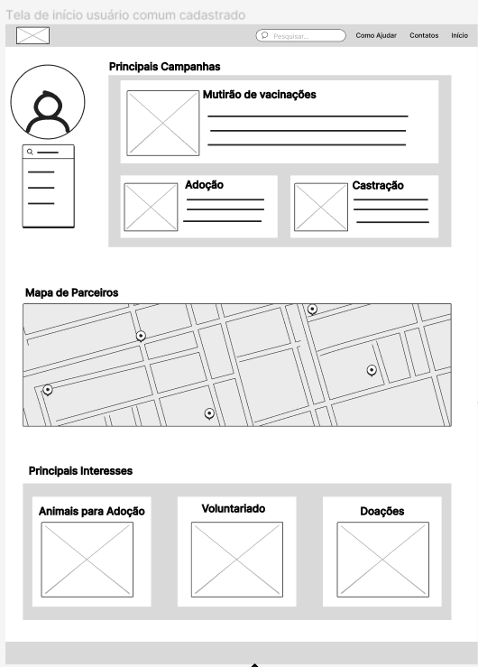
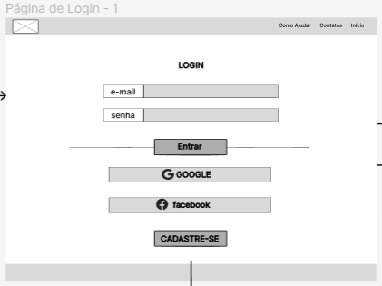
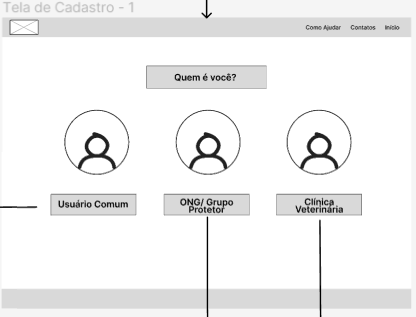
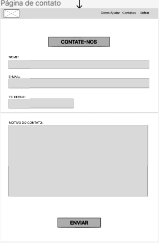
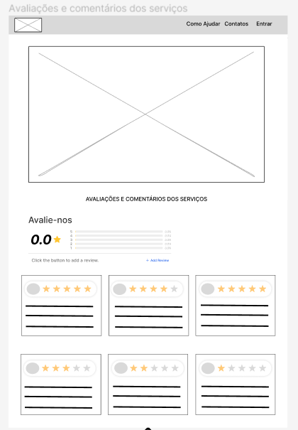

# Projeto de Interface

Visão geral da interação do usuário pelas telas do sistema e protótipo interativo das telas com as funcionalidades que fazem parte do sistema (wireframes).

## User Flow

## Wireframes

São protótipos usados em design de interface para sugerir a estrutura de um site web e seu relacionamentos entre suas páginas. Um wireframe web é uma ilustração semelhante do layout de elementos fundamentais na interface.

### Home Page
Essa é a primeira página que irá aparecer para o usuário ao acessar a aplicação contendo a logo um baner de destaques e as principais informações do nosso portal. Com um menu de navegação localizado a esquerda, e os serviços oferecidos além de nossos parceiros.

### Página de login 
Essa página é a que irá aparecer para os usuários ou logarem em suas contas ou fazerem cadastro para login

### Página de cadastro 
Essa tela irá aparecer para o usuário caso ele ainda não tenha um perfil cadastrado, nela o usuario irá escolher qual tipo de cadastro irá fazer (usuário comum, Ong ou Clínica veterinária)

### Tela de cadastro do usuário 

Essa tela é a que irá aparecer para o usuário comum se cadastrar e colocar as informações solicitadas

### Tela de cadastro de ONGs e Clínicas Veterinárias

Essa tela é a que irá aparecer para os administradores de Ongs ou clínicas veterinárias se cadastrarem com algumas informações adicionais

### Perfil do usuário comum 

Esse é o perfil do usuário comum após o cadastrado. Nela irão aparecer as informações do usuário no menu a esquerda, a direita serão apresentadas as princiapais campanhas em vigência na região e mais abaixo um mapa com os parceiros por perto e os principais interesses do usuário como por exemplo adoção, voluntáriado etc

### Perfil das ONGs e Clínicas veterinárias

Esse é o perfil das ONGs ou clínicas que se cadastrarem, nela irá aparecer uma breve descrição da instituição, seus destaques/histórias de sucesso e mais abaixo os serviços oferecidos e uma pequena aba de contatos.

### Tela de contato para as instituições 

Tela onde os usuários poderão entrar em contato diretamente com as instituições através de mensagens diretas 

### Tela de agendamentos 
 Nessa tela os usuários poderão visualizar os serviços oferecidos pelos parceiros por perto e agendar consultas ou visitas para as instituições 

 

 

 ### Tela de Avaliação das Instituiões 
 Tela em que serão apresentadas as instituições e suas avaliações com comentários dos usuário

 

 

 ### Tela dos Fóruns de Discussão 
 Nessas telas o usuário poderá acessar os fóruns de discussão abertos pelos próprios usuários e também pelas próprias ONGs e Clinicas 

 

 

 ### Tela de Artigos Educacionais 
Nessas telas os usuários poderão acessar artigos escritos e mídias com conteúdo educacional a respeito de saúde, lazer e bem estar animal

### Páginas de Adoção dos Pets 

Nessas telas serão apresentadas os pets de cada instituição e detalhes sobre eles para adoção

 

