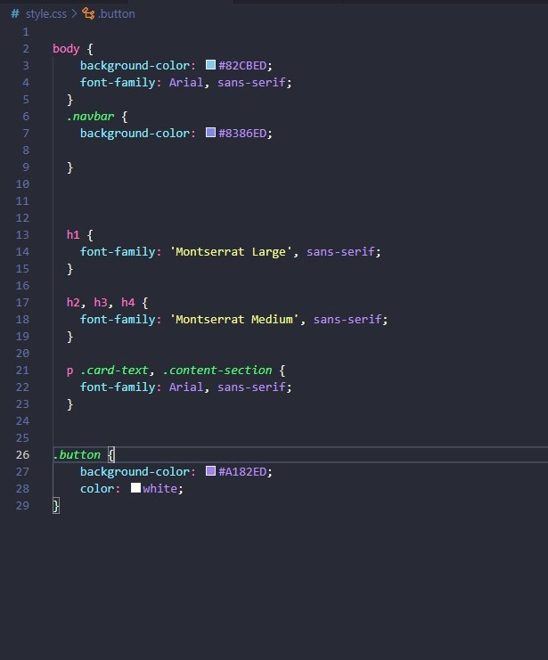

# Template padrão do site

## Design

Todo site será composto por um layout composto por uma barra de navegação localizada no cabeçalho, onde se encontrarão a logo da aplicação no canto esquerdo e um menu de navegação com os links básicos no canto superior esquerdo com a tipografia Arial. O corpo do site será composto por 3 seções de contéudo em que o título principal terá a tipografia Montsserat Large, os títulos de seção terão como tipografia padrão Montsserat medium e os componentes e corpo do texto terão a tipografia Arial.

A barra de navegação e o rodapé das páginas usarão como cor padrão #8386ED

Os botões usados na aplicação terão como cor padrão #A182ED e a fonte padrão será Arial.

E o background da aplicação terá como padrão a cor #82CBED

## Cores

.jpeg)

 #82A9ED
 #A182ED
 #8386ED
 #82CBED
 #BC69F0

## Tipografia

Título da página: Montsserat large

Título da seção: Montsserat medium

Rótulos de componentes: Arial

Corpo do texto: Arial

## Iconografia

